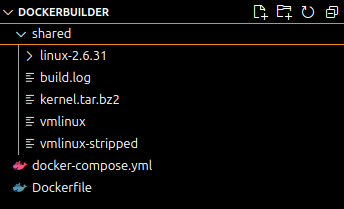
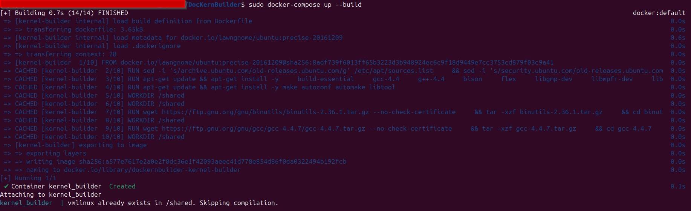
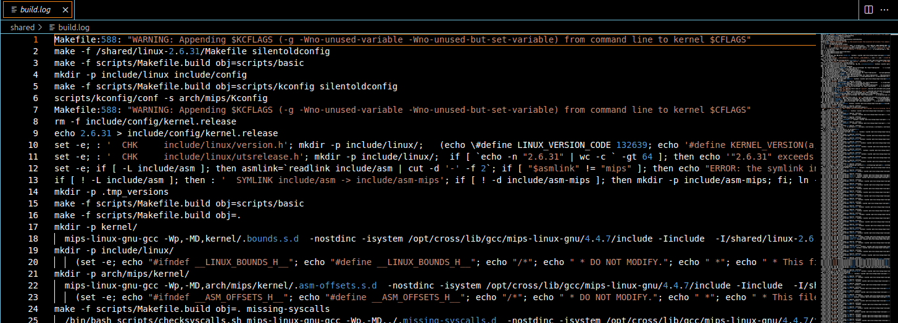
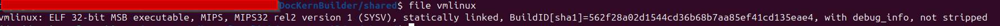

# DocKernBuilder
DocKernBuilder provides an easy-to-use Docker environment for building old Linux kernels required for IOT security research. The setup uses Docker Compose to ensure that all necessary dependencies and configurations are managed within a container.

## Table of Contents
- [Introduction](#introduction)
- [Prerequisites](#prerequisites)
- [Setup](#setup)
- [Build Instructions](#build-instructions)
- [Logging and Output](#logging-and-output)
- [Screenshots](#screenshots)
- [Troubleshooting](#troubleshooting)

## Introduction
This repository contains a Docker setup for compiling the Linux kernel for MIPS architecture. The Docker environment simplifies the build process by providing all required dependencies, including the GCC cross-toolchain, within an isolated container.

## Prerequisites
Before using this project, make sure you have the following installed:
- [Docker](https://docs.docker.com/get-docker/)
- [Docker Compose](https://docs.docker.com/compose/install/)

## Setup

1. Clone this repository to your local machine:

    ```bash
    git clone https://github.com/R3dHash/DocKernBuilder.git
    cd DocKernBuilder
    ```

2. Ensure that the `docker-compose.yml` and `Dockerfile` are in the same directory.

3. The shared directory `./shared` will be used to store kernel sources, logs, and compiled kernel binaries.

## Build Instructions

1. Start the container with Docker Compose:

    ```bash
    docker-compose up --build
    ```

2. Once the container is running, it will automatically begin the process of downloading, extracting, and compiling the Linux kernel for MIPS.

3. The kernel image (`vmlinux`) and a stripped version (`vmlinux-stripped`) will be available in the `./shared` directory on your host machine after the build completes.

## Logging and Output

The logs of the kernel build are saved inside the container and can be accessed using the following commands:

```bash
docker logs kernel_builder
```

Additionally, logs are saved in `/shared/build.log`.

## Screenshots

Include screenshots of the following steps:

1. **DocKernBuilder tree project**

    

2. **Docker Compose running the build**

    

3. **Kernel Compilation Log**

    

4. **Compiled Kernel Output**

    

## Troubleshooting

### Common Issues

- **Out of memory errors**: If your system runs out of memory during the build process, consider limiting the number of jobs (`-j` flag) in the `Dockerfile`.
- **Slow build times**: You can improve build times by allocating more resources to Docker (CPU and memory).

For more troubleshooting help, please consult the Docker [documentation](https://docs.docker.com/) or raise an issue in this repository.

